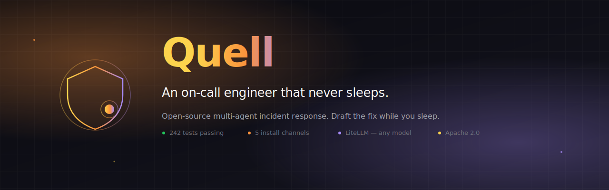
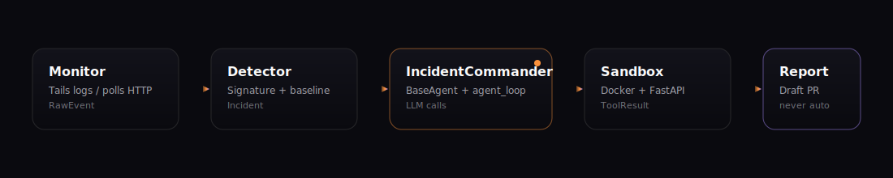
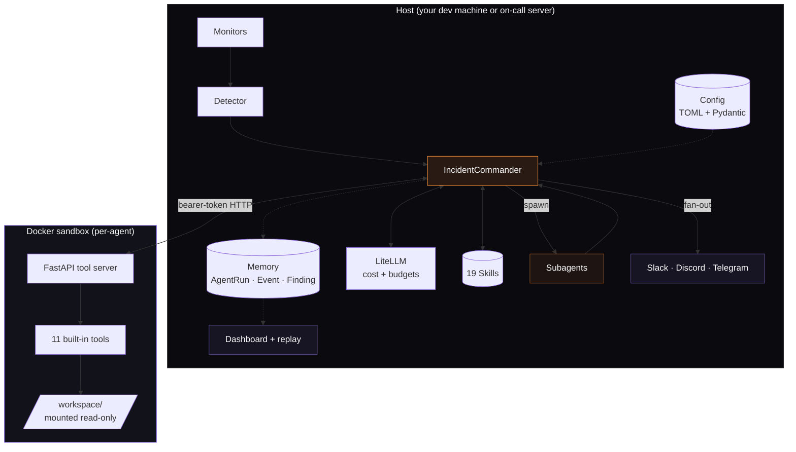

<!-- Hero banner — renders natively on GitHub -->
<p align="center">
  
</p>

<p align="center">
  <a href="https://github.com/bhartiyaanshul/quell/releases/latest"></a>
  <a href="https://github.com/bhartiyaanshul/quell/actions"></a>
  
  
  <a href="./LICENSE"></a>
  <a href="https://www.python.org"></a>
  <a href="https://github.com/bhartiyaanshul/quell/stargazers"></a>
</p>

<p align="center">
  <a href="https://quell.anshulbuilds.xyz"><strong>Website</strong></a> &middot;
  <a href="docs/getting-started.md"><strong>Getting started</strong></a> &middot;
  <a href="docs/commands.md"><strong>Commands</strong></a> &middot;
  <a href="docs/architecture.md"><strong>Architecture</strong></a> &middot;
  <a href="docs/extending.md"><strong>Extend</strong></a> &middot;
  <a href="https://github.com/bhartiyaanshul/quell/discussions"><strong>Community</strong></a>
</p>

---

> [!NOTE]
> **Quell watches your production logs, investigates incidents via LLM-backed agents running inside a Docker sandbox, and produces a structured root-cause report with a proposed fix.** Your engineers wake up to a draft PR, not a page.

## Why Quell?

<table>
<tr>
<td width="50%" valign="top">

### Before Quell

- 3am alert, bleary-eyed engineer.
- 10 minutes finding the right log file.
- Another 15 grepping for the stack trace.
- Another 20 tracing through five services.
- By the time root cause is clear, the incident is an hour old.
- The draft PR gets written tomorrow (if at all).

</td>
<td width="50%" valign="top">

### With Quell

- Alert fires, autonomous investigation starts.
- `IncidentCommander` reads logs, greps code, traces git history.
- Specialist subagents work in parallel via `asyncio.Queue`.
- A root-cause report lands in ~30 seconds.
- Draft PR proposal waits for human review when you sign on.
- You approve, merge, go back to sleep.

</td>
</tr>
</table>

> [!IMPORTANT]
> **Quell never auto-merges.** Every proposed fix is a **draft PR** that requires a human to review and merge. Safety over speed.

---

## See it in action

<!-- Video tag renders natively in GitHub when the file exists.
     MP4 source first, GIF fallback beneath. -->
<p align="center">
  <video src="https://raw.githubusercontent.com/bhartiyaanshul/quell/main/docs/media/hero-demo.mp4" controls muted loop playsinline width="720"></video>
</p>

<p align="center">
  
</p>

<details>
<summary><b>No media yet? Here is the textual storyboard of the same run.</b></summary>

```console
$ quell watch
10:02:45  INFO  monitor: tailing /var/log/my-app/error.log
10:02:47  ERROR TypeError: Cannot read properties of null (reading 'id')
                  at processOrder (src/checkout.ts:42:18)
10:02:47  INFO  detector: new signature 7a9e42f8 -- severity=high
10:02:47  INFO  commander: spawning incident_commander (5 skills matched)
10:02:49  INFO  tool: code_read src/checkout.ts lines 40-50
10:02:52  INFO  tool: git_blame src/checkout.ts:42
10:02:58  INFO  agent: finish_incident -- null-deref on order.user
incident inc_a1b2c3 resolved in 13s -- see `quell show inc_a1b2c3`
```

</details>

---

## Install

Pick the channel that fits your environment. All five install the same binary.

### curl

```bash
curl -fsSL https://raw.githubusercontent.com/bhartiyaanshul/quell/main/install.sh | bash
```

Any POSIX shell. Probes for a prebuilt binary first, falls back to pipx + source automatically. **Works today.**

### npm

```bash
npm i -g quell-agent
```

For JavaScript-oriented developers. The postinstall hook downloads the native binary, so nothing on the Python side is needed.

### Homebrew

```bash
brew install bhartiyaanshul/quell/quell
```

For macOS and Linux brew users. Installs into `/opt/homebrew/bin` (Apple silicon) or `/usr/local/bin` (Intel / Linux).

### pipx

```bash
pipx install quell-agent
```

For Python users who already have pipx. Creates an isolated venv under `~/.local`.

### Standalone binary

```bash
curl -sSL https://github.com/bhartiyaanshul/quell/releases/latest/download/quell-$(uname -s)-$(uname -m).tar.gz \
  | tar xz -C /usr/local/bin
```

No runtime at all. The archive bundles CPython and every dependency. Available for macOS arm64, Linux x86_64, and Windows x86_64.

> [!TIP]
> All five install paths are wired through the release pipeline; the `curl` one-liner is the most universally exercised. Full cascade in [`packaging/README.md`](packaging/README.md).

---

## Quick start

Four commands, about two minutes.

```bash
cd ~/src/my-app   # the repo you want Quell to watch
quell init        # interactive wizard -- stores API key in OS keychain
quell doctor      # verify Python, git, Docker, and your API key
quell watch       # start monitor -> detector -> agent loop
```

<table>
<tr>
<td width="50%" valign="top">

**`quell init`** — interactive setup wizard


Detects your project type, asks for an LLM provider, stores the API
key in your OS keychain, writes `.quell/config.toml`.

</td>
<td width="50%" valign="top">

**`quell doctor`** — environment check


Verifies Python 3.12+, git, Docker daemon, config parse, and LLM key.
One coloured table with exit code 0/1 for CI use.

</td>
</tr>
<tr>
<td width="50%" valign="top">

**`quell history`** — recent incidents


Reverse-chronological list of every incident Quell has investigated.
Filter with `--limit`.

</td>
<td width="50%" valign="top">

**`quell show <id>`** — incident detail


Root cause, evidence, proposed fix, occurrence count, first/last
seen timestamps, linked PR URL.

</td>
</tr>
<tr>
<td width="50%" valign="top">

**`quell dashboard`** — local web UI <sup>v0.2</sup>

Boots a Next.js + FastAPI dashboard at `http://127.0.0.1:7777` with
incident list, run timelines, findings, and aggregate stats. Auto-opens
your browser; pass `--no-open` for CI.

</td>
<td width="50%" valign="top">

**`quell replay <id>`** — terminal timeline <sup>v0.2</sup>

Prints the full event stream for a past investigation — every LLM
call, tool call, latency, cost, and error — as a chronological
timeline. Same data the dashboard renders interactively.

</td>
</tr>
<tr>
<td width="50%" valign="top">

**`quell test-notifier <channel>`** — verify webhooks <sup>v0.2</sup>

Fires a synthetic incident through Slack / Discord / Telegram so you
can confirm webhook URLs and bot tokens are wired up before real
traffic hits.

</td>
<td width="50%" valign="top">

&nbsp;

</td>
</tr>
</table>

Full walkthrough in [**docs/getting-started.md**](docs/getting-started.md).

---

## How it works

```mermaid
flowchart LR
  subgraph Sources
    LF[local-file]
    HP[http-poll]
    VC[vercel]
    SN[sentry]
  end
  LF --> M[Monitor]
  HP --> M
  VC --> M
  SN --> M
  M -->|RawEvent| D[Detector<br/>signature + 24h baseline]
  D -->|Incident| IC{IncidentCommander}
  IC -->|spawns| SA1[log-analyst]
  IC -->|spawns| SA2[code-detective]
  IC -->|spawns| SA3[git-historian]
  SA1 & SA2 & SA3 -->|tool calls| SB[Docker sandbox<br/>FastAPI tool server]
  SB -->|ToolResult| IC
  IC -->|finish_incident| R[Structured report<br/>Draft PR]

  style IC fill:#fb923c20,stroke:#fb923c
  style R fill:#a78bfa20,stroke:#a78bfa
  style SB fill:#12121a,stroke:#27272a
```

<p align="center">
   detector -> incident commander -> sandbox -> report" width="100%"/>
</p>



| Stage | What it does | Code |
|-------|--------------|------|
| 1. Monitor | Emits a `RawEvent` per log line / HTTP probe / Vercel or Sentry payload | [`quell/monitors/`](quell/monitors/) |
| 2. Detector | Fingerprints events (normalised 16-char hex); fires on new / spike / high-severity | [`quell/detector/`](quell/detector/) |
| 3. Commander | Root `IncidentCommander` reads logs, greps code, reasons, optionally spawns specialist subagents | [`quell/agents/`](quell/agents/) |
| 4. Sandbox | Every code-touching tool runs inside a Docker container with your workspace mounted **read-only** | [`quell/runtime/`](quell/runtime/) · [`quell/tool_server/`](quell/tool_server/) |
| 5. Report | Structured `{root_cause, evidence, proposed_fix, status}`, wraps a draft PR for human review | [`quell/tools/reporting/`](quell/tools/reporting/) |
| 6. Persist | One `AgentRun` row per investigation plus per-iteration `Event` and structured `Finding` rows for the dashboard + replay | [`quell/memory/`](quell/memory/) |
| 7. Notify | Fans the result out to Slack / Discord / Telegram in parallel | [`quell/notifiers/`](quell/notifiers/) |

---

## Features

<table>
<tr>
<td width="33%" valign="top">

### Sandboxed by default

Every tool that touches code runs inside Docker with your workspace
mounted **read-only**. Per-sandbox bearer-token auth on the FastAPI
tool server.

[docs/architecture.md](docs/architecture.md#runtime--quellruntime)

</td>
<td width="33%" valign="top">

### Multi-agent coordination

`IncidentCommander` spawns specialist subagents through an
`AgentGraph`; they exchange messages through an `asyncio.Queue` broker.
Parallel investigations, sequential reasoning.

[docs/architecture.md](docs/architecture.md#agents--quellagents)

</td>
<td width="33%" valign="top">

### Bring your own model

Built on **LiteLLM** — OpenAI, Anthropic, Google Gemini, Ollama, or
any custom endpoint. One line of TOML to switch. No lock-in.

[docs/configuration.md](docs/configuration.md#llm--llm-provider)

</td>
</tr>
<tr>
<td width="33%" valign="top">

### Skill runbooks

Markdown + YAML frontmatter runbooks get auto-injected into the agent's
system prompt when their triggers match an incident. **Nineteen** come
bundled — Stripe, OpenAI, null-deref, DNS, SSL, memory, disk, deadlock,
Django/Flask/Rails/Spring/Express, Postgres, Redis, Docker, Kubernetes.

[docs/extending.md](docs/extending.md#writing-a-skill)

</td>
<td width="33%" valign="top">

### Draft PRs, never auto-merge

Every proposed fix is a draft PR. Humans review, humans merge. No
silent changes, no 3am surprises, no trust-me-bro commits.

[SECURITY.md](SECURITY.md)

</td>
<td width="33%" valign="top">

### No telemetry by default

Your code, your logs, your infrastructure. Nothing leaves your
machine unless you explicitly configure a remote monitor or LLM
endpoint. Telemetry is opt-in only.

[docs/configuration.md](docs/configuration.md)

</td>
</tr>
<tr>
<td width="33%" valign="top">

### Notify your team

Slack, Discord, and Telegram channels fan out in parallel once an
investigation completes. Configure once in TOML, verify with
`quell test-notifier <channel>`, never mix transient errors across
channels.

[docs/configuration.md](docs/configuration.md#notifiers)

</td>
<td width="33%" valign="top">

### Web dashboard + replay

`quell dashboard` boots a local Next.js + FastAPI UI for incidents,
runs, findings, and aggregate stats. `quell replay <id>` prints the
same event stream as a terminal timeline. Read-only, no Cloud
required.

[docs/commands.md](docs/commands.md#dashboard)

</td>
<td width="33%" valign="top">

### Cost tracking + budgets

Per-model rate card across Anthropic / OpenAI / Google / Ollama. Every
run records input + output tokens and a USD estimate; `max_cost_usd`
in `.quell/config.toml` halts a runaway investigation before it
lights money on fire.

[docs/configuration.md](docs/configuration.md#agent)

</td>
</tr>
</table>

---

## What is in the box

### 11 built-in tools

| Category | Tool | What it does |
|----------|------|--------------|
| Code | `code_read` | Read a file (optionally with line range) |
| Code | `code_grep` | ripgrep-backed content search with path-traversal guard |
| Git | `git_log` | Recent commits with author and timestamp |
| Git | `git_blame` | Line-level authorship |
| Git | `git_diff` | Diff between refs or working tree |
| Monitoring | `http_probe` | Hit an HTTP endpoint, return status + headers + body |
| Monitoring | `logs_query` | Tail a local log with substring filter |
| Reporting | `create_incident_report` | Structured incident summary |
| Reporting | `create_postmortem` | Blameless postmortem in Markdown |
| Coordination | `agent_finish` | Subagent signals completion |
| Coordination | `finish_incident` | Root agent closes the investigation |

Plus four inter-agent tools (`create_agent`, `send_message`,
`wait_for_message`, `view_graph`) added in Phase 13.

### 19 bundled skill runbooks

| Slug | Category | Severity | Triggers when |
|------|----------|----------|---------------|
| `stripe-webhook-timeout` | incidents | high | error mentions `stripe-signature` or `webhook timeout` |
| `unhandled-null` | incidents | medium | error mentions `NoneType`, `null is not an object`, `Cannot read propert` |
| `openai-rate-limit` | incidents | high | error mentions `rate_limit_exceeded`, `429`, `tokens per minute` |
| `dns-resolution-failure` | incidents | high | error mentions `EAI_AGAIN`, `getaddrinfo`, `unknown host` |
| `ssl-certificate-expired` | incidents | high | error mentions `certificate expired`, `CERT_HAS_EXPIRED` |
| `memory-leak` | incidents | high | RSS climbs without GC drop, OOMKilled, heap snapshots diverge |
| `disk-full` | incidents | critical | error mentions `ENOSPC`, `no space left on device`, write failures |
| `database-deadlock` | incidents | high | error mentions `deadlock detected`, `lock wait timeout` |
| `fastapi` / `nextjs-app-router` | frameworks | medium | framework matches or stack trace fingerprints |
| `django` / `flask` / `rails` / `spring-boot` / `express` | frameworks | medium | framework matches or stack trace fingerprints |
| `postgres` / `redis` | technologies | high | tech stack matches, error mentions known signals |
| `docker` / `kubernetes` | technologies | high | container/pod-level failures, OOM, CrashLoopBackOff |

Add your own by dropping a `.md` file in [`quell/skills/<category>/`](quell/skills/).
See [**docs/extending.md**](docs/extending.md#writing-a-skill).

---

## Architecture



Eleven subsystems, every boundary typed.

| Subsystem | Lines of Python | Test coverage |
|-----------|-----------------|---------------|
| `quell/config/` | ~400 | 24 tests |
| `quell/memory/` | ~770 | 40 tests |
| `quell/monitors/` | ~600 | 24 tests |
| `quell/llm/` | ~530 | 41 tests |
| `quell/tools/` | ~700 | 42 tests |
| `quell/agents/` | ~1 100 | 33 tests |
| `quell/skills/` | ~360 | 30 tests |
| `quell/runtime/` + `quell/tool_server/` | ~400 | 16 tests |
| `quell/notifiers/` | ~410 | 20 tests |
| `quell/dashboard/` + `quell/replay/` | ~570 | 16 tests |
| **Total** | **~5 800 LoC** | **302 tests** |

Deep dive in [**docs/architecture.md**](docs/architecture.md).

---

## Documentation

<table>
<tr>
<td valign="top" width="33%">

### Start here

- [**Getting started**](docs/getting-started.md) — zero to running investigation in 10 min
- [Installation](docs/installation.md) — all five install paths
- [Troubleshooting](docs/troubleshooting.md) — common errors, one-command fixes

</td>
<td valign="top" width="33%">

### Reference

- [Commands](docs/commands.md) — every `quell` subcommand
- [Configuration](docs/configuration.md) — `.quell/config.toml` schema
- [Architecture](docs/architecture.md) — subsystem deep dive

</td>
<td valign="top" width="33%">

### Build on it

- [Extending Quell](docs/extending.md) — add a skill or a tool
- [Packaging](packaging/README.md) — how one tag ships everywhere
- [Phase 16 launch](docs/LAUNCH.md) — manual launch runbook

</td>
</tr>
</table>

---

## FAQ

<details>
<summary><b>Does Quell send my code to an LLM provider?</b></summary>

Only the fragments the agent explicitly reads through its tools, and
those are gated by the sandbox, which only sees whatever is in the
workspace you mount. You can swap LiteLLM to a local model like
Ollama if you do not want any code leaving your machine at all.

</details>

<details>
<summary><b>Will Quell modify my code?</b></summary>

No. Every tool that touches the filesystem runs inside a Docker
sandbox with the workspace mounted **read-only**. Fixes are proposed
as **draft PRs** only, never pushed, never merged, and require a
human to approve.

</details>

<details>
<summary><b>What LLMs are supported?</b></summary>

Anything LiteLLM supports. OpenAI (GPT-4o, GPT-5), Anthropic (Claude
Haiku / Sonnet / Opus), Google Gemini, Ollama local models, any
OpenAI-compatible endpoint. Swap via one line of TOML.

</details>

<details>
<summary><b>How expensive is a typical investigation?</b></summary>

A typical incident runs 3–7 agent iterations and consumes 15–40k input
tokens plus 1–3k output tokens. On `claude-haiku-4-5` that is roughly
$0.01–0.03 per incident. As of v0.2, every run records its own token +
USD cost and a hard `max_cost_usd` cap in `.quell/config.toml` halts a
runaway investigation before it lights money on fire. `quell stats`
shows the rolling per-incident total.

</details>

<details>
<summary><b>Does it work without Docker?</b></summary>

The unit tests and the "dry run" walkthrough work without Docker.
Real production investigations of untrusted code should run under
Docker for the read-only workspace and network isolation guarantees.

</details>

<details>
<summary><b>Is it production-ready?</b></summary>

Quell is **v0.2.0 alpha**. Core flow works end-to-end (302 tests),
v0.1.x configs are forward-compatible, and the new persistence,
notifier, and dashboard layers are in active use. Expect rough edges
around non-English logs, long stack traces, and rare LLM failure
modes. Run Quell against staging first. File issues and we respond
fast.

</details>

<details>
<summary><b>Can I self-host the dashboard?</b></summary>

Yes — `quell dashboard` boots a read-only Next.js + FastAPI UI on
`http://127.0.0.1:7777` with incident list, run timelines, findings,
and aggregate stats. The compiled SPA ships inside the Python wheel,
so no separate Node runtime is needed at install time. Bind it to a
different host with `--host 0.0.0.0` if you want it on a shared
on-call box.

</details>

<details>
<summary><b>Where do alerts go?</b></summary>

`quell.notifiers` ships Slack, Discord, and Telegram channels. Add
one (or all) under `[[notifiers]]` in `.quell/config.toml`, run
`quell test-notifier slack` (or `discord`, `telegram`) to verify the
wiring, then `quell watch` will fan a structured incident summary out
to every configured channel in parallel as soon as the agent finishes.

</details>

<details>
<summary><b>How does Quell compare to existing tools?</b></summary>

Quell is not a monitoring tool (Sentry / Datadog already do that).
Not a chatbot (Quell is autonomous, not interactive). Not an
auto-merger (humans always review). It sits on top of your existing
monitoring: Quell consumes Sentry / Vercel / log events, investigates
the underlying cause, and produces a report.

</details>

---

## Community

<table>
<tr>
<td valign="top" width="50%">

### Contribute

Read [**CONTRIBUTING.md**](CONTRIBUTING.md) for the dev loop and the
stop-gate (ruff format, ruff check, mypy strict, pytest — all four
must pass before a merge).

Good first issues are labelled on GitHub. Drop into
[Discussions](https://github.com/bhartiyaanshul/quell/discussions)
if you are not sure where to start.

</td>
<td valign="top" width="50%">

### Report a bug or vulnerability

- Regular bugs → [GitHub Issues](https://github.com/bhartiyaanshul/quell/issues)
- Security → [private Security Advisory](https://github.com/bhartiyaanshul/quell/security/advisories/new) (the advisory flow is also used for conduct reports — see [CODE_OF_CONDUCT.md](CODE_OF_CONDUCT.md))

</td>
</tr>
</table>

---

## Roadmap

Quell is built across 22 phases documented in [`BUILD_PLAN.md`](BUILD_PLAN.md).

- **v0.1 — phases 1–16 (shipped).** Config, memory, monitors, LLM, tools, agents, skills, detector, Docker runtime, tool server, built-in tools, agent graph, end-to-end integration, polish, public launch.
- **v0.2 — phases 17–22 (shipped).** Slack / Discord / Telegram notifiers, expanded 19-skill library, AgentRun + Event + Finding persistence, per-model cost tracking with `max_cost_usd` budgets, local web dashboard, terminal `quell replay`.
- **v0.3 (next).** Multi-repo coordination, cross-incident learning, richer dashboard filters.
- **v1.0 (aspirational).** Production-ready, typed per-incident cost budgets, hosted Cloud option (opt-in only — CLI stays self-hostable forever).

---

## Development

```bash
# One-time editable install with dev deps
curl -fsSL https://raw.githubusercontent.com/bhartiyaanshul/quell/main/install.sh | bash -s -- --dev

# Stop-gate — all four must pass before merging
poetry run ruff format quell/ tests/ --check
poetry run ruff check  quell/ tests/
poetry run mypy        quell/
poetry run pytest      tests/ -q
```

Full dev loop in [`CONTRIBUTING.md`](CONTRIBUTING.md).

### Landing page

The marketing site at [**quell.anshulbuilds.xyz**](https://quell.anshulbuilds.xyz) lives in [`landing/`](landing/).

```bash
cd landing
npm install
npm run dev      # http://localhost:3000 with hot reload
npm run build    # produces ./out/ — deploy anywhere static
```

Next.js 14 + TailwindCSS + Framer Motion. See [`landing/README.md`](landing/README.md) for the component map.

---

## Credits

<p align="center">
  Built by <a href="https://x.com/Bhartiyaanshul">Anshul Bhartiya</a> — <a href="https://github.com/bhartiyaanshul">@bhartiyaanshul</a><br/>
  <br/>
  <sub>Apache 2.0 · Open source · No telemetry · Your code stays on your machine.</sub>
</p>

<p align="center">
  <a href="./LICENSE"></a>
  <a href="https://github.com/bhartiyaanshul/quell/stargazers"></a>
  <a href="https://github.com/bhartiyaanshul/quell/fork"></a>
</p>
